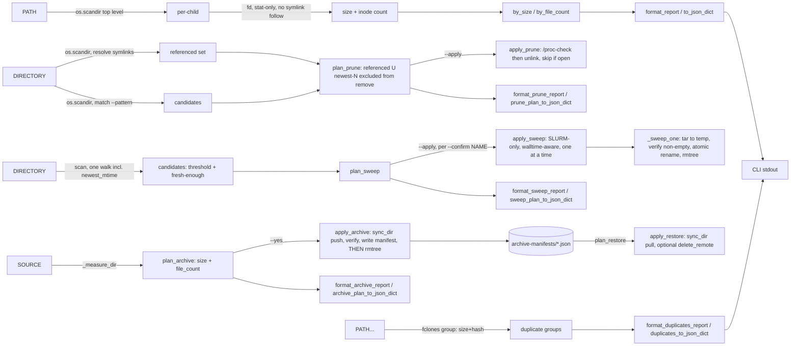

# scitex-storage

<p align="center">
  <a href="https://scitex.ai">
    
  </a>
</p>

<p align="center"><b>Research-data storage triage — a read-only, stat-only scan (via <code>fd</code>) that finds the biggest space and inode (file-count) consumers on your disk, safe rotation (referenced-file-aware for build artifacts, compute-node-only tar-in-place for HPC inode hogs), copy-verify-then-remove tiering to NAS, and an opt-in exact-duplicate finder (via <code>fclones</code>).</b></p>

<p align="center">
  <a href="https://scitex-storage.readthedocs.io/">Full Documentation</a> · <code>pip install scitex-storage</code>
</p>

<!-- scitex-badges:start -->
<p align="center">
  <a href="https://pypi.org/project/scitex-storage/"></a>
  <a href="https://pypi.org/project/scitex-storage/"></a>
  <a href="https://github.com/scitex-ai/scitex-storage/actions/workflows/ci.yml"></a>
</p>
<p align="center">
  <a href="https://codecov.io/gh/scitex-ai/scitex-storage"></a>
</p>
<!-- scitex-badges:end -->

---

## Problem and Solution

| # | Problem | Solution |
|---|---------|----------|
| 1 | **A disk hits 100% and you don't know which directory ate it** — `du -sh *` storms the filesystem and follows symlinks onto slow network mounts | **`scitex-storage scan`** — a read-only, stat-only walk (via `fd`) that reports total **bytes per top-level child**, sorted biggest-first, never following symlinked dirs |
| 2 | **Inodes run out (`No space left on device` with GBs free)** — `du` measures bytes, not the millions of tiny files starving an HPC quota | **The `FILES` column** — every child's inode count, and `--sort files` to rank by it, so an inode hog surfaces even when it's small on disk |
| 3 | **A build directory fills up with dated images (SIFs, tarballs, ...) and an age-only cleanup deletes one still in use** — the currently-live file is often the *oldest*-looking one still symlinked in | **`scitex-storage images prune`** — rotates to the newest N, but a file any symlink in the directory currently resolves to is never a candidate, regardless of age. Dry-run by default |
| 4 | **A GPFS/HPC fileset hits its inode quota from millions of small files** — deleting real data isn't an option, and the fix (tar it) reads file content, which is barred from HPC login nodes | **`scitex-storage sweep`** — tars an inode-hog directory in place (many files → one), compute-node-only (refuses without `$SLURM_JOB_ID`), explicit per-directory `--confirm`, freshness-excludes anything still active |
| 5 | **Local disk fills up with directories that should move to NAS, but "just delete after copying" risks a partial/failed copy silently losing data** | **`scitex-storage archive --to nas\|nas2`** — copy-verify-then-remove over ssh (scitex-ssh's `sync_dir`), checksummed by default, manifest written before the local copy is removed, `restore` reads it back |
| 6 | **Duplicated project copies waste space** (`dataset (1).zip`, `dataset_final_v2.zip`, ...) | **`scitex-storage find-duplicates`** — an explicitly opt-in, separate verb (via `fclones`) that hashes file contents to report exact-duplicate groups; kept out of `scan` on purpose (see below) |

## Installation

```bash
pip install scitex-storage
```

### System dependencies

`scan` and `find-duplicates` each shell out to one established, actively-
maintained **Rust** CLI for their hot path instead of a hand-rolled Python
walk/hash — a pure-Python `os.walk` or `hashlib` pass is far too slow once
you point this at multi-terabyte, multi-million-file storage (this tool is
built to scan things like a 4TB NVMe, a multi-TB NAS, or an HDD array).

| Binary | Used by | Purpose | Project |
|---|---|---|---|
| `fd` (`fdfind` on Debian/Ubuntu) | `scan` | directory walk (replaces `os.walk`) | [sharkdp/fd](https://github.com/sharkdp/fd) |
| `fclones` | `find-duplicates` | size+hash duplicate detection (replaces `hashlib`) | [pkolaczk/fclones](https://github.com/pkolaczk/fclones) |

```bash
# Debian / Ubuntu
sudo apt install fd-find              # installs the binary as `fdfind`
cargo install fclones                 # no apt package as of this writing

# macOS (Homebrew)
brew install fd fclones

# cargo (any platform, if you have a Rust toolchain)
cargo install fd-find fclones
```

Neither binary is required to **install** `scitex-storage` — `pip install
scitex-storage` never needs them, and there is no PyPI package for either
(they're not Python libraries). `fd` IS a hard **runtime** dependency of
`scan`; `fclones` IS a hard runtime dependency of `find-duplicates`. If a
binary is missing, the relevant command fails fast with a clear, actionable
error (install instructions included) rather than silently falling back to
a slow pure-Python walk/hash. `scan` never needs `fclones` — it doesn't
read file contents at all (see below).

Check what scitex-storage needs system-wide any time with:

```bash
python -m scitex_storage._system_deps
```

### GUI plugin (optional)

scitex-storage ships a minimal Django-based GUI plugin
(`src/scitex_storage/_django/`) — a browsable view of `scan()` results,
installable standalone (`scitex-storage start-gui`) or as a
scitex-hub plugin mounted at `/storage/`, following the same
scitex-app/scitex-ui convention as scitex-writer/scitex-scholar/
scitex-todo/figrecipe. It is a **first scaffold** (proves the mounting
contract; not the full disk-treemap UI yet) and is entirely optional:

```bash
pip install scitex-storage[gui]
scitex-storage start-gui
```

#### Configuration

Copy [`.env.example`](.env.example) to `.env` (gitignored) at your
project root, then edit:

```bash
cp .env.example .env
$EDITOR .env
```

CLI flags always override env vars. The full list of variables (with
inline comments) lives in `.env.example` — both are consumed only by
the optional GUI plugin above; the core CLI reads none of them.

## Quick Start

```bash
# No PATH → inventory ~/.scitex and ~/proj
scitex-storage scan

# A specific tree, ranked by inode count
scitex-storage scan ~/proj --sort files
```

```
scitex-storage scan  /home/user/.scitex
=======================================
88.4 GB in 412,003 files across 9 top-level children  (sorted by size)

        SIZE       FILES  CHILD
  ----------  ----------  ------------------------
     71.2 GB     118,204  scholar/
      9.1 GB     251,880  agent-container/
      4.0 GB      12,033  todo/
      ...
  ----------  ----------  ------------------------
     88.4 GB     412,003  TOTAL
```

Everything is **read-only**: `scan` only stats, never reads file contents,
never follows symlinked directories, and never moves or deletes anything.
It is safe to point at a nearly-full disk or an HPC login node.

### Are you about to run out of inodes?

Different question, much cheaper answer. A filesystem can have terabytes
free and still fail **every write** because it is out of *inodes* — and
the jobs that die rarely say so. `check-inodes` is one `statvfs` per path:
O(1) rather than O(files), no `fd`, no login shell, no module load.

```bash
# Am I about to hit the wall?
scitex-storage check-inodes /data/gpfs/projects/punim0264
```

```
scitex-storage check-inodes
===========================
   USED%          USED         TOTAL  MOUNT                 PATH
  ------  ------------  ------------  --------------------  --------------------
    96.2     6,731,073     7,000,000  /data/gpfs            /data/gpfs/projects/punim0264  <-- CRITICAL
```

That is a real reading (Spartan, 2026-07-17) — and that project was at
**70% disk**. Space said fine; inodes were four percentage points from
every write failing.

On a GPFS **independent fileset** — how HPC per-project directories are
usually carved out — `statvfs` reports *that project's quota*, so on those
paths this answers the question that actually kills jobs, with no
`mmlsquota` and no login shell.

Verdicts are three-state and never conflated:

| verdict | meaning |
|---|---|
| `measured` | real numbers from a real inode table |
| `not-applicable` | btrfs/ZFS allocate inodes on demand and cannot run out — **never** rendered as a reassuring `0%` |
| `could-not-look` | unreadable path or wedged mount — **never** rendered as `0%` either |

Exit codes carry the same distinction, because unattended callers read
the exit code and not the table: `0` measured and under `--warn-at`
(default 90%), `1` at/over it, `2` could not look. `2` is deliberately not
`0` — a monitor that cannot tell *healthy* from *never read it* will
report healthy for filesystems it never looked at.

```bash
# Cron: alarm on trouble, and alarm just as loudly on blindness.
scitex-storage check-inodes /data --json || notify "inode check failed ($?)"
```

```bash
# Found something worth checking for exact duplicates? A SEPARATE,
# explicitly opt-in command -- this one DOES read file contents to hash
# them, so use --max-depth on a slow/nearly-full path.
scitex-storage find-duplicates ~/proj/old-scan
```

```
3 duplicate groups:

  2 files, 5.0 GB each:
    projects/2022-thesis/dataset.zip
    projects/2022-thesis/dataset (1).zip
  ...
```

## 1 Interfaces

<details open>
<summary><strong>CLI</strong></summary>

<br>

```bash
scitex-storage scan [PATH ...] [--top N] [--sort size|files] [--max-depth D] [--json]
scitex-storage find-duplicates PATH [PATH ...] [--max-depth D] [--json]
```

**`scan`** (stat-only, `fd`-backed — never reads file contents):

| Flag | Default | Meaning |
|---|---|---|
| `PATH ...` | `~/.scitex ~/proj` | One or more roots. Missing default roots are skipped; a missing *explicit* PATH is a hard error |
| `--top N` | 20 | How many top children to print per root |
| `--sort` | `size` | Rank children by total `size` or by inode `files` count |
| `--max-depth D` | unlimited | Cap recursion depth per child (login-node / network-path safety) |
| `--json` | off | Emit machine-readable JSON instead of the text table |

```bash
scitex-storage images prune DIRECTORY [--keep N] [--pattern GLOB] [--apply] [--json]
```

| Flag | Default | Meaning |
|---|---|---|
| `DIRECTORY` | (required) | Directory of versioned files to rotate, e.g. a SIF build dir |
| `--keep N` | 5 | Target retained count. Files any symlink in `DIRECTORY` references are kept on top of this |
| `--pattern` | `*.sif` | Glob matched against candidate filenames |
| `--apply` | off | Actually delete. Skips (never deletes) any candidate a running process still has open. Without it, prints the plan only (dry-run) |
| `--json` | off | Emit machine-readable JSON instead of the text report |

```bash
$ scitex-storage images prune ~/.scitex/agent-container/containers/sac-base
scitex-storage images prune  /home/user/.scitex/agent-container/containers/sac-base
====================================================================================
1 referenced (always kept), 4 newest kept, 2 to remove

  WOULD REMOVE:
        1.3 GB  sac-base-2026-0512-212752.sif
        1.3 GB  sac-base-2026-0513-083535.sif

  2.6 GB reclaimable
  (dry-run — pass --apply to actually delete)
```

```bash
scitex-storage sweep DIRECTORY --threshold-files N [--min-age-hours H] [--apply --confirm NAME ...] [--min-remaining-seconds S] [--json]
```

| Flag | Default | Meaning |
|---|---|---|
| `DIRECTORY` | (required) | Directory whose immediate children are sweep candidates |
| `--threshold-files N` | (required, no default) | Minimum file count to qualify as a candidate |
| `--min-age-hours` | 24 | Exclude a candidate if its newest file is younger than this |
| `--apply` | off | Actually tar + remove. Requires `--confirm` |
| `--confirm NAME` | — | Explicit per-directory consent (repeatable). Never a blanket apply |
| `--min-remaining-seconds` | 300 | Stop before starting a candidate if less SLURM walltime remains |
| `--json` | off | Emit machine-readable JSON instead of the text report |

`--apply` **refuses to run outside a SLURM allocation** (`$SLURM_JOB_ID` must
be set) — tarring reads file content and the cleanup is a heavy metadata
op, both barred from Spartan login nodes. Submit via `sbatch` or
`srun --overlap --jobid=<held-allocation>`.

```bash
$ scitex-storage sweep /data/gpfs/projects/punim0264/runs --threshold-files 5000
scitex-storage sweep  /data/gpfs/projects/punim0264/runs
==========================================================
threshold >= 5,000 files, min age 24h  (1 candidate(s), 0 skipped as too fresh)

  CANDIDATES (dry-run):
        18,204  old-run-42  (~18,203 inodes reclaimable)

  18,203 inodes reclaimable
  (dry-run — pass --apply --confirm NAME [--confirm NAME ...] to sweep)
```

```bash
scitex-storage sweep-status DIRECTORY [--json]
```

Read-only: lists directories already swept (a sibling `<name>.tar` exists).

```bash
scitex-storage archive SOURCE --to nas|nas2 [--remote-path PATH] [--exclude PATTERN ...] [--checksum/--no-checksum] [--yes|-y] [--dry-run] [--json]
scitex-storage restore SOURCE [--delete-remote] [--yes|-y] [--dry-run] [--json]
```

| Flag | Default | Meaning |
|---|---|---|
| `SOURCE` | (required) | Directory to archive / the original path to restore to |
| `--to` | (required, `archive` only) | `nas` or `nas2` — the `~/.ssh/config` alias to sync to |
| `--remote-path` | mirrors `SOURCE` under `~/scitex-storage-archive` | Explicit remote path override |
| `--exclude PATTERN` | — | Glob to exclude from the sync (repeatable) |
| `--checksum` / `--no-checksum` | on | Read every byte on both sides (rsync `--checksum`) before removing the local copy |
| `--delete-remote` | off | `restore` only: remove the remote copy after a verified pull |
| `--yes`, `-y` | off | Actually sync/pull + mutate. Canonical mutating-verb flag (`archive`/`restore` are in the ecosystem's hardcoded mutating-verb list, unlike `images prune`/`sweep`'s `--apply`) |
| `--dry-run` | — | Explicit spelling of the default (no side effects either way) |
| `--json` | off | Emit machine-readable JSON instead of the text report |

`archive` is copy-verify-then-remove, never delete-then-copy: a failed sync
leaves `SOURCE` completely untouched and no manifest is written. The
manifest (`~/.scitex/scitex-storage/runtime/archive-manifests/`) is what
`restore` reads back — it never needs `SOURCE` to still exist.

**`find-duplicates`** (`fclones`-backed — DOES read file contents to hash them; a separate, explicitly opt-in verb, never run implicitly by `scan`):

| Flag | Default | Meaning |
|---|---|---|
| `PATH ...` | *(required)* | One or more roots to search for exact duplicates |
| `--max-depth D` | unlimited | Cap recursion depth (login-node / network-path safety) |
| `--json` | off | Emit machine-readable JSON instead of the text report |

Other top-level commands (ecosystem-standard, per every scitex-* CLI):
`list-python-apis` (introspect the Python API), `mcp list-tools`
(no MCP server shipped yet — reports zero tools), `--help-recursive`.

</details>

<details>
<summary><strong>Python API</strong></summary>

<br>

```python
import scitex_storage as ss

result = ss.scan("~/.scitex")           # read-only, stat-only walk
result.total_size                        # bytes across all children
result.total_files                       # inodes across all children
result.by_size()[0]                      # biggest child (ChildUsage)
result.by_file_count()[0]                # child with the most inodes

for r in ss.scan_roots(["~/.scitex", "~/proj"]):
    print(r.root, r.total_size, r.total_files)

plan = ss.plan_prune("~/.scitex/agent-container/containers/sac-base", keep=5)
plan.remove                              # candidates that would be deleted
plan.reclaimable_bytes                   # bytes those candidates hold

result = ss.apply_prune(plan)            # never touches referenced or open files
result.removed                           # candidates actually unlinked
result.skipped_in_use                    # candidates skipped: [(candidate, pids), ...]
result.reclaimed_bytes                   # bytes actually freed

sweep_plan = ss.plan_sweep("/data/gpfs/projects/punim0264/runs", threshold_files=5000)
sweep_plan.candidates                    # inode-hog children, old enough to be safe
sweep_plan.skipped_fresh                 # met the threshold but too recently touched

sweep_result = ss.apply_sweep(sweep_plan, confirm_names=["old-run-42"])  # SLURM-only
sweep_result.swept                       # [SweptCandidate(tar_path, member_count, ...), ...]
sweep_result.reclaimed_inodes

ss.sweep_status("/data/gpfs/projects/punim0264/runs")  # what's already swept

archive_plan = ss.plan_archive("~/proj/old-experiment", "nas2")
archive_plan.remote_path                 # default: mirrors the source path
manifest = ss.apply_archive(archive_plan)  # sync, verify, write manifest, remove source

restore_plan = ss.plan_restore("~/proj/old-experiment")  # reads the manifest back
ss.apply_restore(restore_plan)           # pulls it back; keeps the remote copy by default

# Separate, explicitly opt-in -- reads file contents to hash them.
groups = ss.find_duplicates(["~/proj/old-scan"])
for group in groups:
    print(len(group), "identical files:", group)
```

</details>

## Architecture



`scan`'s walk and `find-duplicates`'s hashing are both delegated to Rust
CLIs for speed at multi-TB scale (see "System dependencies" above) instead
of a hand-rolled `os.walk`/`hashlib` reimplementation. They are
deliberately separate pipelines, not a shared one: `scan` must stay
stat-only (safe to point at a 100%-full disk), and finding exact
duplicates fundamentally requires reading bytes, which `scan` never does.

```
scitex_storage/
├── _scan.py        ← scan, scan_roots, ChildUsage, RootScan (fd-backed)
├── _duplicates.py  ← find_duplicates (fclones-backed)
├── _images.py      ← plan_prune, apply_prune, PruneCandidate, PrunePlan
├── _sweep.py       ← plan_sweep, apply_sweep, sweep_status, SweepPlan, SweepResult
├── _archive.py     ← plan_archive, apply_archive, plan_restore, apply_restore, ArchiveManifest
├── _report.py      ← format_report, format_duplicates_report, to_json_dict, format_prune_report, format_sweep_report, format_archive_report, format_size
└── _cli/           ← scan, find-duplicates, images prune, sweep, sweep-status, archive, restore, list-python-apis, mcp list-tools
```

## Roadmap (not implemented)

Discovery (`scan`), rotation (`images prune`, `sweep`), and migration
(`archive`/`restore`) are layers 1-3 of a larger, safety-first design —
**scan → recommend → dry-run → copy → verify → quarantine → delete**,
never an immediate destructive action:

```
scitex-storage
├── Discovery       what exists (size + inodes)             <- scan (done)
├── Rotation        prune / tar superseded or hog files       <- images prune, sweep (done)
├── Classification  what kind of data it is                  <- planned
├── Policy          where it should live                     <- planned
├── Migration       safe copy/move (archive --to nas|nas2)     <- archive, restore (done)
├── Verification    checksum + count verify after move         <- rsync --checksum (done)
└── Retention       keep/quarantine/delete rules                 <- planned
```

Backends beyond ssh/rsync (S3-compatible, Gitea/GitHub) are planned but not
present in this release.

## Part of SciTeX

`scitex-storage` is part of [**SciTeX**](https://scitex.ai).

>Four Freedoms for Research
>
>0. The freedom to **run** your research anywhere — your machine, your terms.
>1. The freedom to **study** how every step works — from raw data to final manuscript.
>2. The freedom to **redistribute** your workflows, not just your papers.
>3. The freedom to **modify** any module and share improvements with the community.
>
>AGPL-3.0 — because we believe research infrastructure deserves the same freedoms as the software it runs on.

## License

AGPL-3.0 — see [LICENSE](LICENSE) for details.

---

<p align="center">
  <a href="https://scitex.ai" target="_blank"></a>
</p>
