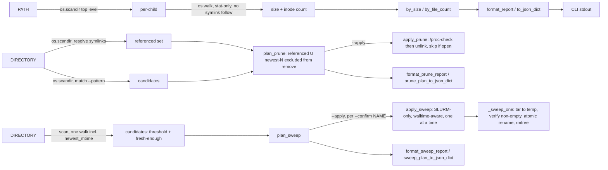

# scitex-storage

<p align="center">
  <a href="https://scitex.ai">
    
  </a>
</p>

<p align="center"><b>Research-data storage triage — a read-only, stat-only scan that finds the biggest space and inode (file-count) consumers on your disk, plus safe rotation: referenced-file-aware for versioned build artifacts, and compute-node-only tar-in-place for HPC inode hogs.</b></p>

<p align="center">
  <a href="https://scitex-storage.readthedocs.io/">Full Documentation</a> · <code>pip install scitex-storage</code>
</p>

<!-- scitex-badges:start -->
<p align="center">
  <a href="https://pypi.org/project/scitex-storage/"></a>
  <a href="https://pypi.org/project/scitex-storage/"></a>
  <a href="https://github.com/scitex-ai/scitex-storage/actions/workflows/ci.yml"></a>
</p>
<p align="center">
  <a href="https://codecov.io/gh/scitex-ai/scitex-storage"></a>
</p>
<!-- scitex-badges:end -->

---

## Problem and Solution

| # | Problem | Solution |
|---|---------|----------|
| 1 | **A disk hits 100% and you don't know which directory ate it** — `du -sh *` storms the filesystem and follows symlinks onto slow network mounts | **`scitex-storage scan`** — a read-only, stat-only walk that reports total **bytes per top-level child**, sorted biggest-first, never following symlinked dirs |
| 2 | **Inodes run out (`No space left on device` with GBs free)** — `du` measures bytes, not the millions of tiny files starving an HPC quota | **The `FILES` column** — every child's inode count, and `--sort files` to rank by it, so an inode hog surfaces even when it's small on disk |
| 3 | **A build directory fills up with dated images (SIFs, tarballs, ...) and an age-only cleanup deletes one still in use** — the currently-live file is often the *oldest*-looking one still symlinked in | **`scitex-storage images prune`** — rotates to the newest N, but a file any symlink in the directory currently resolves to is never a candidate, regardless of age. Dry-run by default |
| 4 | **A GPFS/HPC fileset hits its inode quota from millions of small files** — deleting real data isn't an option, and the fix (tar it) reads file content, which is barred from HPC login nodes | **`scitex-storage sweep`** — tars an inode-hog directory in place (many files → one), compute-node-only (refuses without `$SLURM_JOB_ID`), explicit per-directory `--confirm`, freshness-excludes anything still active |

## Installation

```bash
pip install scitex-storage
```

## Quick Start

```bash
# No PATH → inventory ~/.scitex and ~/proj
scitex-storage scan

# A specific tree, ranked by inode count
scitex-storage scan ~/proj --sort files
```

```
scitex-storage scan  /home/user/.scitex
=======================================
88.4 GB in 412,003 files across 9 top-level children  (sorted by size)

        SIZE       FILES  CHILD
  ----------  ----------  ------------------------
     71.2 GB     118,204  scholar/
      9.1 GB     251,880  agent-container/
      4.0 GB      12,033  todo/
      ...
  ----------  ----------  ------------------------
     88.4 GB     412,003  TOTAL
```

Everything is **read-only**: `scan` only calls `os.stat`, never reads file
contents, never follows symlinked directories, and never moves or deletes
anything. It is safe to point at a nearly-full disk or an HPC login node.

## 1 Interfaces

<details open>
<summary><strong>CLI</strong></summary>

<br>

```bash
scitex-storage scan [PATH ...] [--top N] [--sort size|files] [--max-depth D] [--json]
```

| Flag | Default | Meaning |
|---|---|---|
| `PATH ...` | `~/.scitex ~/proj` | One or more roots. Missing default roots are skipped; a missing *explicit* PATH is a hard error |
| `--top N` | 20 | How many top children to print per root |
| `--sort` | `size` | Rank children by total `size` or by inode `files` count |
| `--max-depth D` | unlimited | Cap recursion depth per child (login-node / network-path safety) |
| `--json` | off | Emit machine-readable JSON instead of the text table |

```bash
scitex-storage images prune DIRECTORY [--keep N] [--pattern GLOB] [--apply] [--json]
```

| Flag | Default | Meaning |
|---|---|---|
| `DIRECTORY` | (required) | Directory of versioned files to rotate, e.g. a SIF build dir |
| `--keep N` | 5 | Target retained count. Files any symlink in `DIRECTORY` references are kept on top of this |
| `--pattern` | `*.sif` | Glob matched against candidate filenames |
| `--apply` | off | Actually delete. Skips (never deletes) any candidate a running process still has open. Without it, prints the plan only (dry-run) |
| `--json` | off | Emit machine-readable JSON instead of the text report |

```bash
$ scitex-storage images prune ~/.scitex/agent-container/containers/sac-base
scitex-storage images prune  /home/user/.scitex/agent-container/containers/sac-base
====================================================================================
1 referenced (always kept), 4 newest kept, 2 to remove

  WOULD REMOVE:
        1.3 GB  sac-base-2026-0512-212752.sif
        1.3 GB  sac-base-2026-0513-083535.sif

  2.6 GB reclaimable
  (dry-run — pass --apply to actually delete)
```

```bash
scitex-storage sweep DIRECTORY --threshold-files N [--min-age-hours H] [--apply --confirm NAME ...] [--min-remaining-seconds S] [--json]
```

| Flag | Default | Meaning |
|---|---|---|
| `DIRECTORY` | (required) | Directory whose immediate children are sweep candidates |
| `--threshold-files N` | (required, no default) | Minimum file count to qualify as a candidate |
| `--min-age-hours` | 24 | Exclude a candidate if its newest file is younger than this |
| `--apply` | off | Actually tar + remove. Requires `--confirm` |
| `--confirm NAME` | — | Explicit per-directory consent (repeatable). Never a blanket apply |
| `--min-remaining-seconds` | 300 | Stop before starting a candidate if less SLURM walltime remains |
| `--json` | off | Emit machine-readable JSON instead of the text report |

`--apply` **refuses to run outside a SLURM allocation** (`$SLURM_JOB_ID` must
be set) — tarring reads file content and the cleanup is a heavy metadata
op, both barred from Spartan login nodes. Submit via `sbatch` or
`srun --overlap --jobid=<held-allocation>`.

```bash
$ scitex-storage sweep /data/gpfs/projects/punim0264/runs --threshold-files 5000
scitex-storage sweep  /data/gpfs/projects/punim0264/runs
==========================================================
threshold >= 5,000 files, min age 24h  (1 candidate(s), 0 skipped as too fresh)

  CANDIDATES (dry-run):
        18,204  old-run-42  (~18,203 inodes reclaimable)

  18,203 inodes reclaimable
  (dry-run — pass --apply --confirm NAME [--confirm NAME ...] to sweep)
```

```bash
scitex-storage sweep-status DIRECTORY [--json]
```

Read-only: lists directories already swept (a sibling `<name>.tar` exists).

Other top-level commands (ecosystem-standard, per every scitex-* CLI):
`list-python-apis` (introspect the Python API), `mcp list-tools`
(no MCP server shipped yet — reports zero tools), `--help-recursive`.

</details>

<details>
<summary><strong>Python API</strong></summary>

<br>

```python
import scitex_storage as ss

result = ss.scan("~/.scitex")           # read-only, stat-only walk
result.total_size                        # bytes across all children
result.total_files                       # inodes across all children
result.by_size()[0]                      # biggest child (ChildUsage)
result.by_file_count()[0]                # child with the most inodes

for r in ss.scan_roots(["~/.scitex", "~/proj"]):
    print(r.root, r.total_size, r.total_files)

plan = ss.plan_prune("~/.scitex/agent-container/containers/sac-base", keep=5)
plan.remove                              # candidates that would be deleted
plan.reclaimable_bytes                   # bytes those candidates hold

result = ss.apply_prune(plan)            # never touches referenced or open files
result.removed                           # candidates actually unlinked
result.skipped_in_use                    # candidates skipped: [(candidate, pids), ...]
result.reclaimed_bytes                   # bytes actually freed

sweep_plan = ss.plan_sweep("/data/gpfs/projects/punim0264/runs", threshold_files=5000)
sweep_plan.candidates                    # inode-hog children, old enough to be safe
sweep_plan.skipped_fresh                 # met the threshold but too recently touched

sweep_result = ss.apply_sweep(sweep_plan, confirm_names=["old-run-42"])  # SLURM-only
sweep_result.swept                       # [SweptCandidate(tar_path, member_count, ...), ...]
sweep_result.reclaimed_inodes

ss.sweep_status("/data/gpfs/projects/punim0264/runs")  # what's already swept
```

</details>

## Architecture



```
scitex_storage/
├── _scan.py     ← scan, scan_roots, ChildUsage, RootScan
├── _images.py   ← plan_prune, apply_prune, PruneCandidate, PrunePlan
├── _sweep.py    ← plan_sweep, apply_sweep, sweep_status, SweepPlan, SweepResult
├── _report.py   ← format_report, to_json_dict, format_prune_report, format_sweep_report, format_size
└── _cli/        ← scan, images prune, sweep, sweep-status, list-python-apis, mcp list-tools
```

## Roadmap (not implemented)

Discovery (`scan`) and rotation (`images prune`, `sweep`) are layers 1-2 of
a larger, safety-first design —
**scan → recommend → dry-run → copy → verify → quarantine → delete**,
never an immediate destructive action:

```
scitex-storage
├── Discovery       what exists (size + inodes)             <- scan (done)
├── Rotation        prune / tar superseded or hog files       <- images prune, sweep (done)
├── Classification  what kind of data it is                  <- planned
├── Policy          where it should live                     <- planned
├── Migration       safe copy/move (archive --to nas|nas2)     <- planned
├── Verification    checksum + count verify after move         <- planned
└── Retention       keep/quarantine/delete rules                 <- planned
```

Backends (local disk, NAS via SSH/SMB/NFS, S3-compatible, Gitea/GitHub) and
a project-level manifest format are planned but not present in this release.

## Part of SciTeX

`scitex-storage` is part of [**SciTeX**](https://scitex.ai).

>Four Freedoms for Research
>
>0. The freedom to **run** your research anywhere — your machine, your terms.
>1. The freedom to **study** how every step works — from raw data to final manuscript.
>2. The freedom to **redistribute** your workflows, not just your papers.
>3. The freedom to **modify** any module and share improvements with the community.
>
>AGPL-3.0 — because we believe research infrastructure deserves the same freedoms as the software it runs on.

## License

AGPL-3.0 — see [LICENSE](LICENSE) for details.

---

<p align="center">
  <a href="https://scitex.ai" target="_blank"></a>
</p>
