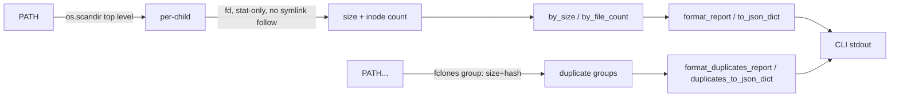

# scitex-storage

<p align="center">
  <a href="https://scitex.ai">
    
  </a>
</p>

<p align="center"><b>Research-data storage triage — a read-only, stat-only scan (via <code>fd</code>) that finds the biggest space and inode (file-count) consumers on your disk, plus an opt-in exact-duplicate finder (via <code>fclones</code>).</b></p>

<p align="center">
  <a href="https://scitex-storage.readthedocs.io/">Full Documentation</a> · <code>pip install scitex-storage</code>
</p>

<!-- scitex-badges:start -->
<p align="center">
  <a href="https://pypi.org/project/scitex-storage/"></a>
  <a href="https://pypi.org/project/scitex-storage/"></a>
  <a href="https://github.com/scitex-ai/scitex-storage/actions/workflows/ci.yml"></a>
</p>
<p align="center">
  <a href="https://codecov.io/gh/scitex-ai/scitex-storage"></a>
</p>
<!-- scitex-badges:end -->

---

## Problem and Solution

| # | Problem | Solution |
|---|---------|----------|
| 1 | **A disk hits 100% and you don't know which directory ate it** — `du -sh *` storms the filesystem and follows symlinks onto slow network mounts | **`scitex-storage scan`** — a read-only, stat-only walk (via `fd`) that reports total **bytes per top-level child**, sorted biggest-first, never following symlinked dirs |
| 2 | **Inodes run out (`No space left on device` with GBs free)** — `du` measures bytes, not the millions of tiny files starving an HPC quota | **The `FILES` column** — every child's inode count, and `--sort files` to rank by it, so an inode hog surfaces even when it's small on disk |
| 3 | **Duplicated project copies waste space** (`dataset (1).zip`, `dataset_final_v2.zip`, ...) | **`scitex-storage find-duplicates`** — an explicitly opt-in, separate verb (via `fclones`) that hashes file contents to report exact-duplicate groups; kept out of `scan` on purpose (see below) |

## Installation

```bash
pip install scitex-storage
```

### System dependencies

`scan` and `find-duplicates` each shell out to one established, actively-
maintained **Rust** CLI for their hot path instead of a hand-rolled Python
walk/hash — a pure-Python `os.walk` or `hashlib` pass is far too slow once
you point this at multi-terabyte, multi-million-file storage (this tool is
built to scan things like a 4TB NVMe, a multi-TB NAS, or an HDD array).

| Binary | Used by | Purpose | Project |
|---|---|---|---|
| `fd` (`fdfind` on Debian/Ubuntu) | `scan` | directory walk (replaces `os.walk`) | [sharkdp/fd](https://github.com/sharkdp/fd) |
| `fclones` | `find-duplicates` | size+hash duplicate detection (replaces `hashlib`) | [pkolaczk/fclones](https://github.com/pkolaczk/fclones) |

```bash
# Debian / Ubuntu
sudo apt install fd-find              # installs the binary as `fdfind`
cargo install fclones                 # no apt package as of this writing

# macOS (Homebrew)
brew install fd fclones

# cargo (any platform, if you have a Rust toolchain)
cargo install fd-find fclones
```

Neither binary is required to **install** `scitex-storage` — `pip install
scitex-storage` never needs them, and there is no PyPI package for either
(they're not Python libraries). `fd` IS a hard **runtime** dependency of
`scan`; `fclones` IS a hard runtime dependency of `find-duplicates`. If a
binary is missing, the relevant command fails fast with a clear, actionable
error (install instructions included) rather than silently falling back to
a slow pure-Python walk/hash. `scan` never needs `fclones` — it doesn't
read file contents at all (see below).

Check what scitex-storage needs system-wide any time with:

```bash
python -m scitex_storage._system_deps
```

## Quick Start

```bash
# No PATH → inventory ~/.scitex and ~/proj
scitex-storage scan

# A specific tree, ranked by inode count
scitex-storage scan ~/proj --sort files
```

```
scitex-storage scan  /home/user/.scitex
=======================================
88.4 GB in 412,003 files across 9 top-level children  (sorted by size)

        SIZE       FILES  CHILD
  ----------  ----------  ------------------------
     71.2 GB     118,204  scholar/
      9.1 GB     251,880  agent-container/
      4.0 GB      12,033  todo/
      ...
  ----------  ----------  ------------------------
     88.4 GB     412,003  TOTAL
```

Everything is **read-only**: `scan` only stats, never reads file contents,
never follows symlinked directories, and never moves or deletes anything.
It is safe to point at a nearly-full disk or an HPC login node.

```bash
# Found something worth checking for exact duplicates? A SEPARATE,
# explicitly opt-in command -- this one DOES read file contents to hash
# them, so use --max-depth on a slow/nearly-full path.
scitex-storage find-duplicates ~/proj/old-scan
```

```
3 duplicate groups:

  2 files, 5.0 GB each:
    projects/2022-thesis/dataset.zip
    projects/2022-thesis/dataset (1).zip
  ...
```

## 1 Interfaces

<details open>
<summary><strong>CLI</strong></summary>

<br>

```bash
scitex-storage scan [PATH ...] [--top N] [--sort size|files] [--max-depth D] [--json]
scitex-storage find-duplicates PATH [PATH ...] [--max-depth D] [--json]
```

**`scan`** (stat-only, `fd`-backed — never reads file contents):

| Flag | Default | Meaning |
|---|---|---|
| `PATH ...` | `~/.scitex ~/proj` | One or more roots. Missing default roots are skipped; a missing *explicit* PATH is a hard error |
| `--top N` | 20 | How many top children to print per root |
| `--sort` | `size` | Rank children by total `size` or by inode `files` count |
| `--max-depth D` | unlimited | Cap recursion depth per child (login-node / network-path safety) |
| `--json` | off | Emit machine-readable JSON instead of the text table |

**`find-duplicates`** (`fclones`-backed — DOES read file contents to hash them; a separate, explicitly opt-in verb, never run implicitly by `scan`):

| Flag | Default | Meaning |
|---|---|---|
| `PATH ...` | *(required)* | One or more roots to search for exact duplicates |
| `--max-depth D` | unlimited | Cap recursion depth (login-node / network-path safety) |
| `--json` | off | Emit machine-readable JSON instead of the text report |

Other top-level commands (ecosystem-standard, per every scitex-* CLI):
`list-python-apis` (introspect the Python API), `mcp list-tools`
(no MCP server shipped yet — reports zero tools), `--help-recursive`.

</details>

<details>
<summary><strong>Python API</strong></summary>

<br>

```python
import scitex_storage as ss

result = ss.scan("~/.scitex")           # read-only, stat-only walk
result.total_size                        # bytes across all children
result.total_files                       # inodes across all children
result.by_size()[0]                      # biggest child (ChildUsage)
result.by_file_count()[0]                # child with the most inodes

for r in ss.scan_roots(["~/.scitex", "~/proj"]):
    print(r.root, r.total_size, r.total_files)

# Separate, explicitly opt-in -- reads file contents to hash them.
groups = ss.find_duplicates(["~/proj/old-scan"])
for group in groups:
    print(len(group), "identical files:", group)
```

</details>

## Architecture



`scan`'s walk and `find-duplicates`'s hashing are both delegated to Rust
CLIs for speed at multi-TB scale (see "System dependencies" above) instead
of a hand-rolled `os.walk`/`hashlib` reimplementation. They are
deliberately separate pipelines, not a shared one: `scan` must stay
stat-only (safe to point at a 100%-full disk), and finding exact
duplicates fundamentally requires reading bytes, which `scan` never does.

```
scitex_storage/
├── _scan.py        ← scan, scan_roots, ChildUsage, RootScan (fd-backed)
├── _duplicates.py  ← find_duplicates (fclones-backed)
├── _report.py      ← format_report, format_duplicates_report, to_json_dict, format_size
└── _cli/           ← scan, find-duplicates, list-python-apis, mcp list-tools
```

## Roadmap (not implemented)

Discovery (this release) is layer 1 of a larger, safety-first design —
**scan → recommend → dry-run → copy → verify → quarantine → delete**,
never an immediate destructive action:

```
scitex-storage
├── Discovery       what exists (size + inodes)             <- scan (done, MVP)
├── Classification  what kind of data it is                  <- planned
├── Policy          where it should live                     <- planned
├── Migration       safe copy/move                            <- planned
├── Verification    checksum + count verify after move         <- planned
└── Retention       keep/quarantine/delete rules                 <- planned
```

Backends (local disk, NAS via SSH/SMB/NFS, S3-compatible, Gitea/GitHub) and
a project-level manifest format are planned but not present in this release.

## Part of SciTeX

`scitex-storage` is part of [**SciTeX**](https://scitex.ai).

>Four Freedoms for Research
>
>0. The freedom to **run** your research anywhere — your machine, your terms.
>1. The freedom to **study** how every step works — from raw data to final manuscript.
>2. The freedom to **redistribute** your workflows, not just your papers.
>3. The freedom to **modify** any module and share improvements with the community.
>
>AGPL-3.0 — because we believe research infrastructure deserves the same freedoms as the software it runs on.

## License

AGPL-3.0 — see [LICENSE](LICENSE) for details.

---

<p align="center">
  <a href="https://scitex.ai" target="_blank"></a>
</p>
