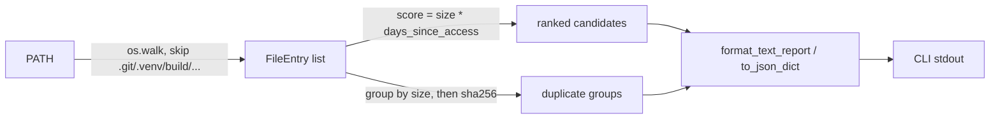

# scitex-storage

<p align="center">
  <a href="https://scitex.ai">
    
  </a>
</p>

<p align="center"><b>Research-data storage triage — scan a directory tree, score files by size &times; staleness, and report space-reclaim / archive candidates.</b></p>

<p align="center">
  <a href="https://scitex-storage.readthedocs.io/">Full Documentation</a> · <code>pip install scitex-storage</code>
</p>

<!-- scitex-badges:start -->
<p align="center">
  <a href="https://pypi.org/project/scitex-storage/"></a>
  <a href="https://pypi.org/project/scitex-storage/"></a>
  <a href="https://github.com/scitex-ai/scitex-storage/actions/workflows/ci.yml"></a>
</p>
<p align="center">
  <a href="https://codecov.io/gh/scitex-ai/scitex-storage"></a>
</p>
<!-- scitex-badges:end -->

---

## What this is (and isn't, yet)

Research machines accumulate large, stale files: build artifacts, old
datasets, forgotten Docker layers, duplicated project copies. Deciding what
is safe to move to slower/cheaper storage (or delete) is tedious to do by
hand and risky to automate carelessly.

`scitex-storage` is the first slice of a planned storage-tiering tool
(local SSD -> NAS SSD -> NAS HDD -> offline archive), following a
safety-first design: **scan -> recommend -> dry-run -> copy -> verify ->
quarantine -> delete**, never an immediate destructive action.

**This release ships only the first step: `scan`.** It is entirely
**read-only** — it never moves, deletes, or modifies anything. Everything
past discovery/scoring/reporting (classification, policy, migration,
NAS/S3/Gitea backends, manifests, versioning) is on the roadmap, not built
yet. Don't point automation at this expecting more than a report.

## Installation

```bash
pip install scitex-storage
```

## Quick Start

```bash
scitex-storage scan ~/projects
```

```
scitex-storage scan report
==========================
Root:            /home/user/projects
Scanned:         2 431 files, 187 directories
Total size:      412.7 GB
Skipped:         .git, node_modules, .venv, build, dist (91.2 GB, regenerable)

Top candidates (size x days-since-access):
  score        size    last access   path
  6 480 000    18.0 GB   360d         projects/old-scan/data/raw.zip
  4 500 000     5.0 GB   900d         projects/2022-thesis/dataset.zip
  1 230 000    12.3 GB    100d        projects/demo/models/checkpoint.pt

Possible duplicates (by size + hash):
  3 files, 5.2 GB total:
    projects/dataset.zip
    projects/dataset (1).zip
    projects/old/dataset_final.zip
```

Scoring follows the simple heuristic from the project's design notes:
`score = size_bytes * days_since_last_access`. Bigger and staler files
float to the top; nothing is touched.

## 1 Interfaces

<details open>
<summary><strong>CLI</strong></summary>

<br>

```bash
scitex-storage scan PATH [--top N] [--json] [--no-dedupe]
```

| Flag | Default | Meaning |
|---|---|---|
| `--top N` | 20 | How many top-scored candidates to print |
| `--json` | off | Emit machine-readable JSON instead of the text report |
| `--no-dedupe` | off | Skip the (size+hash) duplicate-file pass |

Excluded by default (regenerable, "全部無視" per the design notes):
`.git`, `node_modules`, `.venv`, `venv`, `__pycache__`, `build`, `dist`,
`.tox`, `.mypy_cache`, `.pytest_cache`, `.ruff_cache`, `.egg-info`.

Other top-level commands (ecosystem-standard, per every scitex-* CLI):
`list-python-apis` (introspect the Python API), `mcp list-tools`
(no MCP server shipped yet — reports zero tools), `--help-recursive`.

</details>

<details>
<summary><strong>Python API</strong></summary>

<br>

```python
import scitex_storage as ss

result = ss.scan("~/projects")          # read-only walk + scoring
top = result.top_candidates(top=20)     # biggest, stalest files first
dupes = result.duplicate_groups         # (size+hash) duplicate groups
```

</details>

## Architecture



```
scitex_storage/
├── _scan.py     ← walk_tree, scan, find_duplicates, FileEntry, ScanResult
├── _report.py   ← format_text_report, to_json_dict, format_size
└── _cli/        ← scan, list-python-apis, mcp list-tools
```

## Roadmap (not implemented)

Discovery (this release) is layer 1 of a larger design:

```
scitex-storage
├── Discovery       what exists                          <- scan (done, MVP)
├── Classification  what kind of data it is               <- planned
├── Policy          where it should live                  <- planned
├── Migration       safe copy/move                         <- planned
├── Verification    checksum + count verify after move      <- planned
├── Versioning      snapshots/history                        <- planned
├── Provenance      where data came from                      <- planned
└── Retention       keep/quarantine/delete rules                <- planned
```

Backends (local disk, NAS via SSH/SMB/NFS, S3-compatible, Gitea/GitHub) and
a project-level manifest format are planned but not present in this
release. See the repo issue tracker for the staged plan.

## Part of SciTeX

`scitex-storage` is part of [**SciTeX**](https://scitex.ai).

>Four Freedoms for Research
>
>0. The freedom to **run** your research anywhere — your machine, your terms.
>1. The freedom to **study** how every step works — from raw data to final manuscript.
>2. The freedom to **redistribute** your workflows, not just your papers.
>3. The freedom to **modify** any module and share improvements with the community.
>
>AGPL-3.0 — because we believe research infrastructure deserves the same freedoms as the software it runs on.

## License

AGPL-3.0 — see [LICENSE](LICENSE) for details.

---

<p align="center">
  <a href="https://scitex.ai" target="_blank"></a>
</p>
